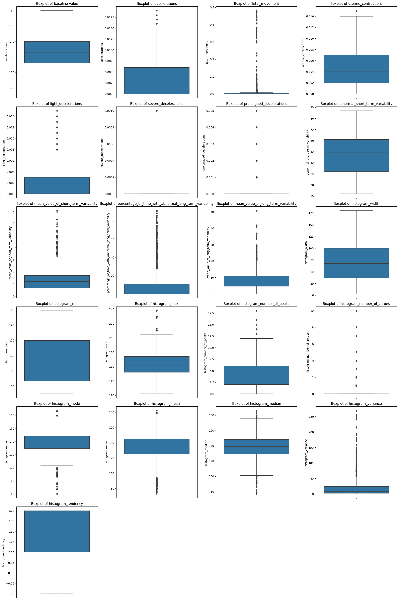

# Fetal Health Analysis and Classification

Cardiotocography (CTG) is used during pregnancy to monitor fetal heart rate and uterine contractions. It is monitor fetal well-being and allows early detection of fetal distress.

CTG interpretation helps in determining if the pregnancy is high or low risk. An abnormal CTG may indicate the need for further investigations and potential intervention.

**Project Goal**: The project goal is to analyze the fetal health data and predict the outcome of Cardiotocogram test to ensure the well being of the fetus.

## Data

The data is available on [Kaggle](https://www.kaggle.com/datasets/andrewmvd/fetal-health-classification/data), as well as in this repo.

### Data Preprocessing

There are **2126** total observations with total of 22 columns including the target column. All the data are of **float64** type.

The target column have three distinct classes:
1. **Normal**
2. **Suspect**
3. **Pathological**

### Data Visualization

Let's first visualize the distribution of the numerical features

 

Most of the features are slightly to highly skewed. Specially **light_decelerations** , **fetal_movement**, **prolongued_decelerations**, **histogram_number_of_zeroes**, **histogram_variance** are highly skewed.  

 

The target column is highly imbalanced, with class 1 having the most data in compared to class 2 and 3. 

As class 2 and 3 have less amount of data, their distributions are not well defined as well as not normal. The distribution of class 1 is more or less normal.

The box plot shows distribution of the data as well as lower bound, median, upper bound as well as the outliers that don't fall under the lower and upper bounds. Most of the feature columns has **outliers** or extreme values.

For **Multi-variate analysis** we used pairplot

 

With the pairplot, we can visualize some correlation of all the numerical features with each other.

